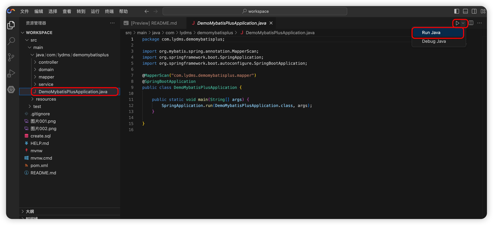
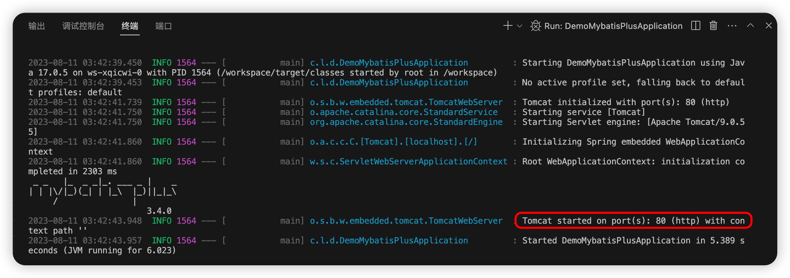

# demo-mybatis-plus
本项目来源于[《腾讯云 Cloud Studio 实战训练营》](https://marketing.csdn.net/p/06a21ca7f4a1843512fa8f8c40a16635)的参赛作品，该作品在腾讯云 [Cloud Studio](https://www.cloudstudio.net/?utm=csdn) 中运行无误。


## 项目介绍
本项目是初始化Mybatis-plus的代码，其中内置了Mybatis-plus需要的Jar包。环境方面内置MySQL。
MySQL连接信息：
```
IP：127.0.0.1
账号：root
密码：root
数据库：root
```

## 使用
启动Springboot项目：
打开项目目录：
```
com.lydms.demomybatisplus.DemoMybatisPlusApplication
```
选择右侧运行项目：

启动成功



在浏览器中输入以下地址(前缀随服务不同，地址不同)：
https://oewgaz-yuhsqq-80.preview.myide.io/user/get

就可以查看到的数据
```
[{"id":1,"name":"小明"},{"id":2,"name":"小红"}]
```


## 查看MySQL数据
建表SQL，在create.sql文件中
```sql
CREATE TABLE `user` (
  `id` bigint(20) NOT NULL AUTO_INCREMENT,
  `name` varchar(255) DEFAULT NULL,
  PRIMARY KEY (`id`)
) ENGINE=InnoDBDEFAULT CHARSET=utf8mb4;

INSERT INTO `user` (`id`, `name`) VALUES (1, '小明');
INSERT INTO `user` (`id`, `name`) VALUES (2, '小红');
```
