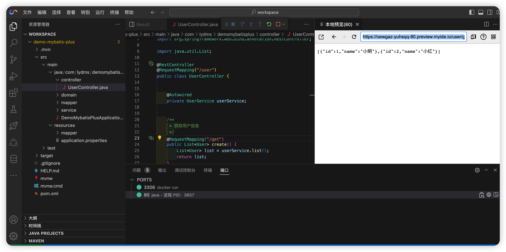
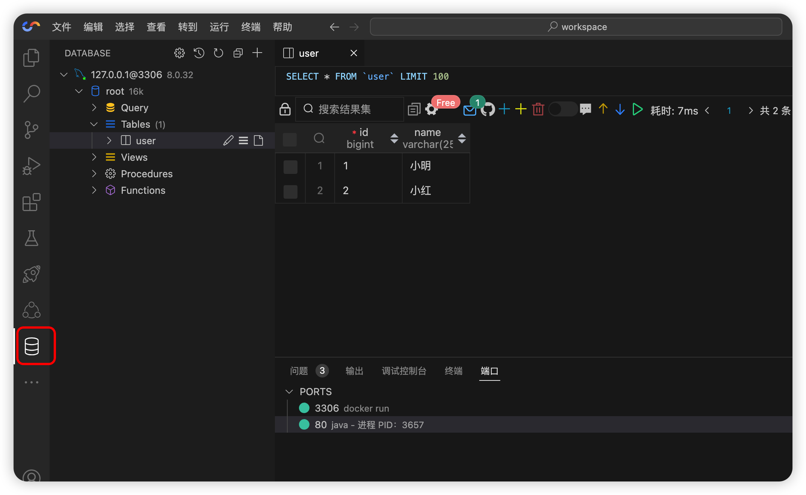

# demo-mybatis-plus

## 项目介绍
本项目是初始化Mybatis-plus的代码，其中内置了Mybatis-plus需要的Jar包。环境方面内置MySQL。
MySQL连接信息：
```
IP：127.0.0.1
账号：root
密码：root
数据库：root
```

## 使用
启动Springboot项目：

在浏览器中输入以下地址(前缀随服务不同，地址不同)：
https://oewgaz-yuhsqq-80.preview.myide.io/user/get

就可以查看到的数据
```
[{"id":1,"name":"小明"},{"id":2,"name":"小红"}]
```


## 查看MySQL数据
